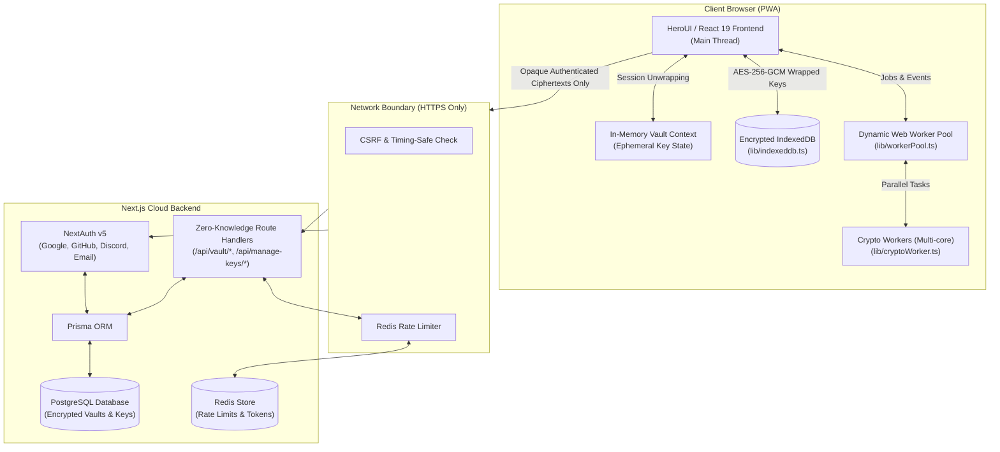

<h1 align="center">Next PGP</h1>

<p align="center">
  <b>Next PGP</b> is an elegant, powerful, and modern Progressive Web App (PWA) built with <b>Next.js</b>. It provides an app-like experience for generating OpenPGP keys, managing keyrings, and securely encrypting and decrypting messages and files with zero-knowledge architecture.
</p>

<p align="center">
  
  
  
  
  
</p>

---

## 🚀 Key Features

* **Advanced Key Generation:**
  * Effortlessly generate cryptographically secure PGP keys.
  * Supports modern elliptic curve and legacy algorithms:
    * **Curve25519 (EdDSA/ECDH)** — *Recommended*
    * **NIST P-256, P-521 (ECDSA/ECDH)**
    * **Brainpool P-256r1, P-512r1 (ECDSA/ECDH)**
    * **RSA 2048, 3072, 4096**
* **Comprehensive Keyring Management:**
  * Add, manage, delete, import, export, and backup keys.
  * Query, import, and publish public keys via public **PGP keyservers** (HKP).
  * Add, modify, or strip key passphrases.
  * Manage and revoke User IDs and subkeys.
* **Encryption & Decryption Suite:**
  * Asymmetric and symmetric text message encryption and decryption.
  * Single file encryption and decryption with integrity verification.
  * **Batch File Processing:** Process multiple files simultaneously with distinct recipient keys.
  * **Folder Recursion:** Recursively encrypt and decrypt entire folder structures, preserving internal paths.
* **Zero-Knowledge Cloud Vaults:**
  * End-to-end encrypted remote key backups.
  * Password-derived keys using **PBKDF2** (1,000,000 iterations, SHA-512) and **AES-256-GCM**.
  * Server-opaque `verificationCipher` — passwords and private keys are never transmitted to or readable by the server.
* **Multithreaded Web Worker Pool:**
  * Dynamic worker pool automatically scales cryptographic tasks across all available CPU cores via `navigator.hardwareConcurrency`.
  * Keeps the interface reactive at 60 FPS even during heavy batch operations.
* **Cross-Platform Progressive Web App (PWA):**
  * Installable on macOS, Windows, Linux, Android, and iOS with offline support.

---

## ⚡ Quick Start

### Prerequisites
* **Node.js**: `22.x` (enforced via [`.nvmrc`](.nvmrc))
* **Package Manager**: [`pnpm`](https://pnpm.io/) (`>= 9.x` or `11.x`)
* **PostgreSQL** & **Redis**

### Installation & Local Run

```bash
# 1. Clone repository
git clone https://github.com/xbeast1/NextPGP.git
cd NextPGP

# 2. Install dependencies (triggers Prisma client generation)
pnpm install

# 3. Configure environment variables
cp .env.example .env
# Edit .env and supply your DATABASE_URL, REDIS, and AUTH_SECRET

# 4. Push database schema
pnpm prisma db push

# 5. Generate local SSL certificates for Web Crypto API support
pnpm setup:https

# 6. Start HTTPS development server
pnpm dev:https
```

Visit **`https://nextpgp-dev.com:3000`** in your browser.

> [!NOTE]
> For a detailed guide on setting up custom host mappings, resolving certificate warnings, and troubleshooting, read the **[Developer Guide](docs/development.md)**.

---

## 🏗 System Architecture

NextPGP separates client-side cryptography from cloud storage via an authenticated zero-knowledge boundary:



---

## 📖 Documentation Hub

Comprehensive architectural, cryptographic, and operational documentation is available in the [`docs/`](docs/) directory:

| Document | Purpose |
| :--- | :--- |
| **[Cryptographic Specification](docs/crypto-spec.md)** | Byte-level wire format, 45-byte NextPGP header, PBKDF2/AES-GCM key derivation, verification ciphers, and zero-knowledge proofs |
| **[System Architecture](docs/architecture.md)** | Web Worker concurrency pool, client-side IndexedDB persistence, ephemeral memory lifecycle, and data models |
| **[Developer & Contribution Guide](docs/development.md)** | Local environment setup, HTTPS certificates, Prisma migrations, running tests with Vitest, and ESLint |
| **[Self-Hosting Guide](docs/self-hosting.md)** | Production deployment, Nginx reverse proxy configuration, OAuth provider setup (Google/GitHub/Discord), and full `.env` variable reference |
| **[Manual Test Matrix](docs/manual-test-matrix.md)** | Comprehensive test matrix for message, file, and folder encryption combinations |

---

## 🧪 Testing & Scripts

```bash
# Run unit & integration tests with Vitest
pnpm test

# Run tests in interactive watch mode
pnpm test:watch

# Run linter checks
pnpm lint

# Build production bundle with Prisma migration deployment
pnpm build

# Launch Prisma Studio to inspect database records
pnpm prisma studio
```

---

## 🛠 Tech Stack

* **Framework:** [Next.js 15](https://nextjs.org/) (App Router) & [React 19](https://react.dev/)
* **Cryptography:** [OpenPGP.js](https://openpgpjs.org/) & Native [Web Crypto API](https://developer.mozilla.org/en-US/docs/Web/API/Web_Crypto_API)
* **UI Components & Styling:** [HeroUI](https://www.heroui.com/) & [Tailwind CSS](https://tailwindcss.com/)
* **Database & ORM:** [PostgreSQL](https://www.postgresql.org/) & [Prisma ORM](https://www.prisma.io/)
* **Authentication:** [NextAuth.js v5](https://authjs.dev/)
* **In-Memory Cache & Rate Limiter:** [Redis](https://redis.io/) / `ioredis`
* **Worker Multithreading:** Custom Dynamic Web Worker Pool
* **Testing:** [Vitest](https://vitest.dev/)

---

## 💻 Video Previews

| Keyring Management | Cloud Sync & Vault | Message & File Encryption |
| :---: | :---: | :---: |
| [](https://www.youtube.com/watch?v=1gl4OlUaibY) | [](https://www.youtube.com/watch?v=YZAAwo0ukS0) | [](https://www.youtube.com/watch?v=KuyIN6AV6SM) |

---

## 📸 Screenshots

### 💻 PC
<p align="center">
  
  
  
  
  
  
  
  
  
  
  
  
</p>

### 📱 Mobile
<p align="center">
  
  
  
  
  
  
  
  
  
  
  
  
</p>

---

## 📝 License

This project is licensed under the [GNU General Public License v3.0](LICENSE).

---

## 💬 Contact & Support

* **GitHub:** [@xbeast1](https://github.com/xbeast1)
* **Email:** [xbeast1@proton.me](mailto:xbeast1@proton.me)

<p align="center">✨ <b>Next PGP</b> simplifies secure messaging. Generate, manage, and encrypt with confidence! ✨</p>
