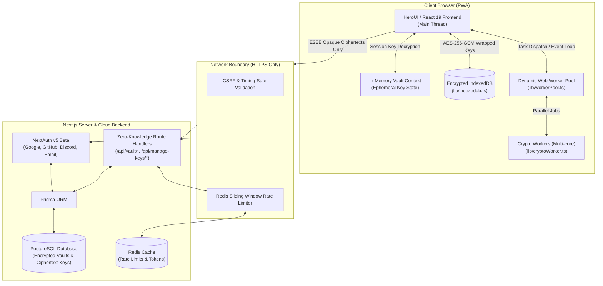

# NextPGP System Architecture

NextPGP is designed as a hybrid **Client-Heavy Progressive Web App (PWA)** combined with a lightweight **Zero-Knowledge Cloud Backend**.

---

## 1. High-Level Architecture Diagram



---

## 2. Client-Side Subsystems

### 2.1 Dynamic Web Worker Pool (`lib/workerPool.ts`)
Cryptographic calculations (particularly Curve25519, RSA 4096, and batch file encryption) are CPU-bound and computationally intensive. To keep the UI reactive and running at 60 FPS:
* The application detects the device's hardware capability using `navigator.hardwareConcurrency`.
* Workers are dynamically spawned in a managed pool.
* Heavy OpenPGP tasks (bulk key generation, recursive folder encryption, file chunking) are dispatched to idle workers via message passing (`postMessage`), ensuring zero frame drops on the main thread.

### 2.2 Local Storage Security & IndexedDB (`lib/indexeddb.ts`)
* Keys stored locally on the client are wrapped with **AES-256-GCM**.
* When **App Password Protection** is active, the master wrapping key is encrypted using a key derived from the user's password via **PBKDF2-SHA256** (1,000,000 iterations).
* Keys are decrypted only at execution time and cached ephemerally in JavaScript memory.

### 2.3 Ephemeral State Management (`context/`)
* Passwords and raw crypto keys are **never stored in `localStorage` or `sessionStorage`**.
* The unencrypted state is retained exclusively in volatile React context memory while the browser tab remains active.
* Page reload or closing the tab automatically locks the vault and purges sensitive memory.

---

## 3. Server-Side & Cloud Subsystems

### 3.1 Zero-Knowledge API Boundary
The server acts purely as an opaque persistence layer:
* **No Decryption Capability**: The server does not possess the keys or passwords required to decrypt any vault or PGP key stored in PostgreSQL.
* **Authentication Challenge**: To unlock a vault, the client downloads the opaque `verificationCipher`, decrypts it locally, and sends proof of validity to obtain a 30-minute JWT session token cookie.

### 3.2 Security & Rate Limiting (`lib/security.ts`, `lib/rate-limiter/`)
* **Sliding Window Rate Limiter**: High-risk endpoints (vault login, unlock, password verification, cloud sync) are throttled via Redis to prevent brute-force attacks.
* **CSRF Protection**: Time-windowed HMAC tokens prevent Cross-Site Request Forgery.
* **Timing Attack Prevention**: Constant-time equality checks (`timingSafeEqual`) are used when verifying hashes and tokens.

---

## 4. Data Layer (Prisma & PostgreSQL)

The database schema ([`prisma/schema.prisma`](file:///Users/xbeast/My-Projects/NextPGP/prisma/schema.prisma)) isolates authentication accounts from encrypted vault storage:

```
User (NextAuth)
 ├── Account (OAuth Providers: Google, GitHub, Discord)
 ├── Session (JWT / DB Session)
 └── Vault (One-to-One with User)
      ├── verificationCipher (Zero-Knowledge encrypted verification envelope)
      ├── deleteOtp & otpExpiresAt (Secure vault deletion flow)
      └── PGPKeys (One-to-Many)
           ├── publicKey (Encrypted ASCII armored key)
           ├── privateKey (Encrypted private key)
           ├── publicKeyHash (Unique hash for duplicate detection)
           └── privateKeyHash (Unique hash for duplicate detection)
```
